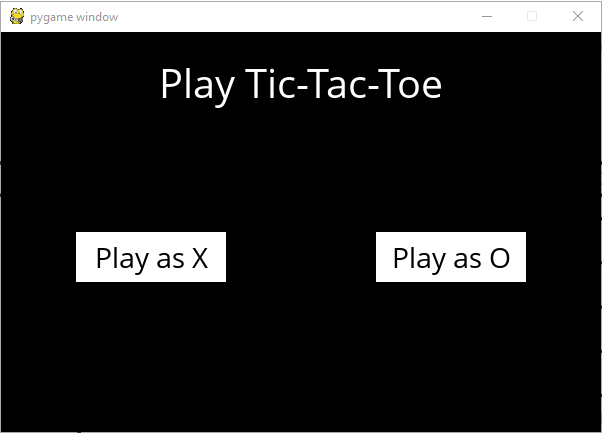
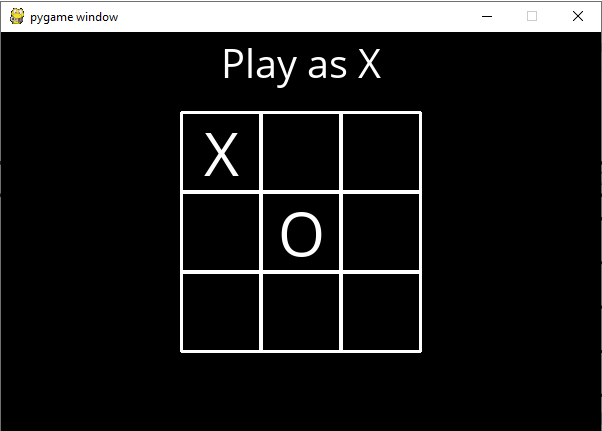
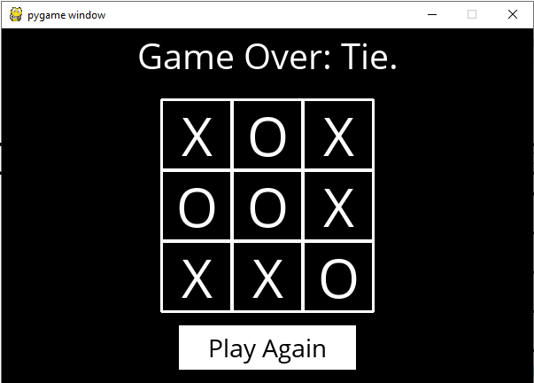

# Tic Tac Toe
### Harvard CS50's Introduction to Artificial Intelligence with Python (Project 0)

This game is never going to let you win!

## Description
In this project, we're implementing an **Artificial Intelligence** bot that plays against you and never lets you win. This is an implementation of **minimax** which is an *adversial search* algorithm that finds out the *best* next move which will lead to human player either loosing or drawing the match. 
**Alpha-beta pruning** is also implemented to optimize the algorithm: `minValue()` and `maxValue()` return the `action` as soon as they find a solution with `utility` of  `-1` and `1` respectively.

## Screenshots

    

    

    

    

